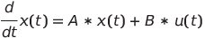

# Requirements

## Introduction

My Project is about solving 1st Order Linear Ordinary Differential Equations(ODE) using numerical methods like Euler Methods and Runge Kutta Methods and present a plot of the solution to the user or save the solution to a csv file. In this project I'm mainly considering linear 1st order ODE which is  time-invarient.

Most of the physical systems can be represented or can be approximated to represent a linear time invarient (LTI) system of 1st order ODE (For example a simple RL circuit or a Mass-Damper System). The following shows the type of equation which is going to be solved by application.

**Equation:**  

 
 
In the above equation the *x(t)* is state variable of the system and *A* and *B* are constants and *u(t)* is the external input to the system.

## Research

Numerical methods for ordinary differential equations are methods used to find numerical approximations to the solutions of ordinary differential equations (ODEs). Their use is also known as *numerical integration*, although this term can also refer to the computation of integrals.

Many differential equations cannot be solved using symbolic computation (*analysis*). For practical purposes, however – such as in engineering – a numeric approximation to the solution is often sufficient.
Ordinary differential equations occur in many scientific disciplines, including physics, chemistry, biology, and economics. In addition, some methods in numerical partial differential equations convert the partial differential equation into an ordinary differential equation, which must then be solved.

## Costs and Features

### Costs

    * My applications is designed to only solve first order ODE which is of Linear Time Invarient type but it can be extended to solve any ODE in future.
    * This application depends on gnuplot for handling its plotting and graphing requirements.

### Features

  * Provide solution to 1st Order Linear ODE.
  * Option for choosing various numercal methods like Euler Methods or Runge Kutta Methods to solve ODEs.
*  Provide a plot of the solution using Gnu plot.
*  Save the solution to csv file.

## SWOT Analysis

## 4W's and 1H's

### Who

This can be used by electical engineers, control system engineers, mechanical engineers or students or anybody who wants an approximate solution to 1st Order Linear ODE.

### What

This is an application that takes a specific ODE with all its parameters, solution limits and step size, external input and returns a solution in the form of a csv file or plot or both. 

### When

Whenever an approximate solution for 1st order linear ODE is required or fast solution is required or when the user wants to visualize the solution this application is quite useful.

### Where

This application can be used in Laboratories, Research and Development fields, College / Universities in order to evaluate systems and models which is of the above specified form.

### How

The user defines his ODE in a file and that file is fed into the application then user is asked to select a numerical method to solve his ODE and he is given an option to save solution to a cvs file or diaplay plot of solution or both.

## Detailed Requirements

### High Level Requirements

| ID | Description | Status |
|-|-|-|
| HLR01 | Application should work both in Windows and Linux | Implemented ✔ |
| HLR02 | Application should take input from user which details the problem | Implemented ✔ |
| HLR03 | Application should solve the ODE problem detailed by the user | ❌ |
| HLR04 | Finally, the solution should be presented as a plot or csv depending on user's choice| ❌ |

### Low Level Requirements

| ID | Description | Status |
|-|-|-|
| LLR01 | **Cross compatibility**   The application must use open source tools which is  available on both windows and linux. The application should use:   1. **GCC** Compiler 2. Build system using **make** 3. **Gnuplot** for handling plots  | Implemented ✔ |
| LLR02 | 1. The user specifies his problem specifications of 1st Order Linear ODE in a text file which is of a certain format  2. This text file is fed into the application which will be parsed to get problem specifications | Implemented ✔ |
| LLR03 | The user should be given the choice of the numerical method which is going to be used to solve his problem | ❌ |
| LLR04 | Three numerical methods should be availabe for solving the ODE, namely:  1. Euler Forward Method 2. Modified Euler Forward Method  3. Runge-Kutta 4 Method| Implemented ✔ |
| LLR05 | The user should be given the choice of how the solution for his problem is presented i.e. through csv or through plots or both | ❌ |
| LLR06 | 1. Application should be capable of saving the solution of ODE to a CSV file 2. Application should be able to display a plot of the solution | Implemented ✔ |
