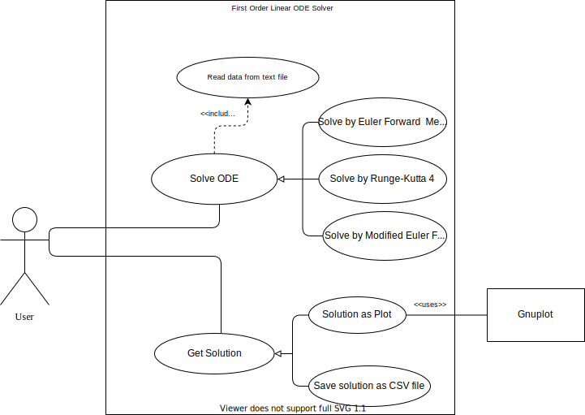
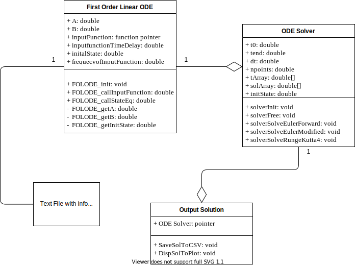

# Design

## High Level Design

### Behavior Diagrams (HLD)

#### Usecase Diagram

#### Sequence Diagram

### Structure Diagrams (HLD)

#### Component Diagram

## Low Level Designs

### Structure Diagrams (LLD)

#### Class Diagram

### Behavior Diagrams (LLD)

#### Activity Diagram

