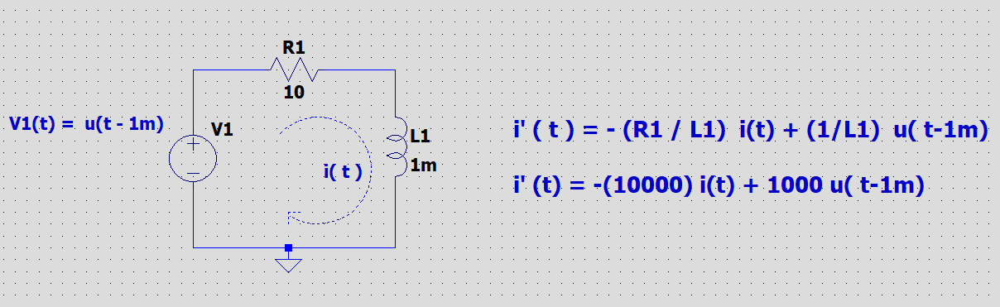

# Quick Guide

In this quick guid we are going to see how to use this application to solver your 1st order LTI ODE systems.

## Forming the 1st Order ODE

Let us take an expample of an RL Ciruit as shown in the figure,  

by writing the differential equations that govern the circuit we have:

**V1(t) = R1 * i(t) + L i'(t)**

*   i'(t) is rate of change of i with respect to time
*   V1(t) = u(t - 1m) ie unit step function with shift of 1m second

Rearranging the equation we have:

**i'(t) = -(R1/L1) * i(t) + (1/L1) * u(t - 1m)**

substituting the values we have:

**i'(t) = -10000 * i(t) + 1000 * u(t - 1e-3)**

## Extracting the parameters that define 1st Order ODE

Compring the above ODE obtained with the standart LTI 1st Order ODE in the figure,

we have:

*   A = -10000
*   B = 1000
*   U = unit step function
*   ts = 1e-3

In the above example of RL circuit initially we assume current i to be 0 as voltage is 0. So, the initial state of current i is 0.

*   x0 = 0

### Solution limits

This is the range of points in which i(t) is solved for. In our example lets us say we want the solution i(t) for t in range 0.0 to 10e-3s with time step of 100e-6s. Then we have,

*   t0 = 0.0
*   tend = 10e-3
*   dt = 100e-6
*   f = 0.0

**NOTE:**

*   unit step function, impulse function, ramp function, sine functions , these are the only fuctions available in this program at this time.
*   unit step function is denoted by *u*, impulse function is denoted by *i*, ramp function is denoted by *r* and sine function is denoted by *s*.
*   For sine function we take in an extra input of frequency of sine wave.
*   frequency input is present for all functions but it only comes into effect if input function is sine.

## Forming inputData.txt file with above collected Data

inputData.txt should be in the following format

    A
    B
    U ts f
    x0
    t0 tend dt

Everything is double expect the parameter **U**. **U** can only be char which is either *u*, *i*, *r* or *s*. **f** is considered only if **U** is *s* but it must have a double value associated to it. Refer to **NOTE** in the above section.

In this example of RLCKT [inputData.txt](../3_Implementation/inputdata.txt) is

    -10e3
    1e3
    u 1e-3 1e3
    0
    0.0 10e-3 100e-6

## Running the Program

Build the program by first changing directory to 3_Implementation and runnimg the make command. Then make sure that inputData.txt is present with all the necessary data and formmating in the directory that you are in. Finallu call the folodesolver executables.

